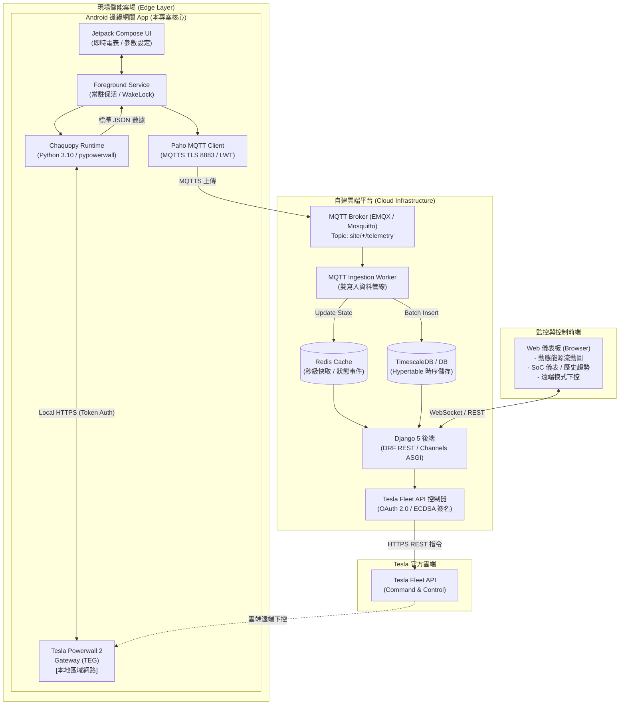

# Tesla Powerwall 能源管理系統 (EMS) 與邊緣端 App 架構說明書

本文件詳細闡述 **Tesla Powerwall 邊緣端 Android Gateway App** 以及整體 **EMS 邊緣至雲端系統** 的軟體架構、設計模式、通訊協定與高可靠性容災機制。

---

## 1. 系統整體架構與邊緣定位 (System Context)

本系統採用 **邊緣運算 (Edge Computing) + 雲端雙寫入 (Cloud Dual-Write) + 官方雲端下控 (Fleet Command)** 的工業物聯網架構。



### 資料面 (Data Plane) 與 控制面 (Control Plane) 分離原則
1. **資料面 (上行遙測，秒級高頻)**：
   現場 TEG ➔ Android App (Chaquopy 本地 HTTPS) ➔ MQTTS (TLS 8883) ➔ 雲端 Ingestion Worker ➔ TimescaleDB / Redis ➔ Web 儀表板 (WebSocket 毫秒級推播)。
2. **控制面 (下行控制，非同步嚴謹稽核)**：
   Web 儀表板 ➔ Django 後端 ➔ Tesla Fleet API 控制器 ➔ Tesla 官方雲端 ➔ 雲端遠端下控 TEG。
   *優勢：控制指令皆經由 Tesla 官方 Fleet API 安全授權並保留完整稽核軌跡，避免現場區域網路直接被外部穿透下控的安全隱患。*

---

## 2. Android 邊緣端 APP 詳細分層架構 (App Architecture)

Android App 本質為一 **工控無人值守網關應用 (Industrial Edge Gateway)**，運行於案場專用平板、工控盒或手機。

```text
┌─────────────────────────────────────────────────────────────────┐
│                    1. Presentation Layer (UI)                   │
│   - MainActivity (Jetpack Compose)                              │
│   - 即時功率卡片 (Solar, Grid, Battery, Home) / SoC % 進度條    │
│   - 案場通訊參數彈窗 (SettingsDialog) / 系統優化豁免按鈕        │
└────────────────────────────────┬────────────────────────────────┘
                                 │ StateFlow (雙向響應)
┌────────────────────────────────▼────────────────────────────────┐
│               2. Domain & Lifecycle Layer (常駐服務)             │
│   - TegForegroundService (FOREGROUND_SERVICE_DATA_SYNC)         │
│   - PowerManager.WakeLock (PARTIAL_WAKE_LOCK 防 CPU 休眠)        │
│   - BootReceiver (BOOT_COMPLETED 開機自啟動恢復)                 │
│   - 定時輪詢協程 (Coroutine Polling Loop, 預設 3 秒)            │
└──────────────────┬─────────────────────────────┬────────────────┘
                   │ JNI 調用                    │ 發布 (QoS 1)
┌──────────────────▼───────────────┐ ┌───────────▼────────────────┐
│   3. Embedded Python (Chaquopy)  │ │   4. Telemetry Transport   │
│   - Python 3.10 Runtime          │ │   - MqttManager (Paho)     │
│   - teg_collector.py             │ │   - MQTTS TLS 8883 加密    │
│   - pypowerwall 原生整合         │ │   - 遺囑機制 (LWT: offline)│
│   - Session Cookie/Token 自動刷新│ │   - 斷網自動重連機制       │
│   - SSL 自簽憑證寬容機制         │ └────────────────────────────┘
└──────────────────┬───────────────┘
                   │ 本機 LAN (HTTPS)
┌──────────────────▼──────────────────────────────────────────────┐
│       5. Physical Edge Gateway (Tesla Powerwall 2 TEG)          │
│   - /api/login/Basic (認證登入)                                 │
│   - /api/meters/aggregates (四項即時功率)                       │
│   - /api/system_status/soe (電池可用容量百分比)                 │
└─────────────────────────────────────────────────────────────────┘
```

---

## 3. 核心模組職責說明

### 模組 1：常駐前台服務 (`TegForegroundService.kt`)
* **定位**：App 運作的心臟，負責保證採集流程 24 小時不中斷。
* **技術機制**：
  1. **Foreground Service**：宣告 `FOREGROUND_SERVICE_DATA_SYNC` 權限，於 Android 通知列綁定 Ongoing 常駐通知，將行程優先級提升至前台（避免被 Android Low Memory Killer 殺除）。
  2. **CPU WakeLock**：申請 `PowerManager.PARTIAL_WAKE_LOCK`，防止 Android 螢幕熄滅時進入 Doze Mode 導致 CPU 停止執行輪詢協程。
  3. **自動重啟機制**：`onStartCommand` 返回 `START_STICKY`，若系統極限狀況下重啟進程，系統會自動重新恢復服務。
  4. **響應式串流**：透過靜態 `StateFlow<TelemetryData?>` 實時向 Compose UI 派發數據，UI 與服務完全解耦。

### 模組 2：Chaquopy 內嵌 Python 執行期 (`teg_collector.py`)
* **定位**：Kotlin 與 Tesla Powerwall 本地通訊協議的橋接引擎。
* **技術機制**：
  1. **免 Python 環境部署**：Chaquopy 15.0+ 直接將 Python 3.10 直譯器與第三方套件（`requests`、`pypowerwall`、`urllib3`）編譯封裝入 APK。
  2. **Session Token 快取**：全局維護 `_CACHED_SESSION`，登入後快取 Cookie 與 Bearer Token，有效期限內不再重複向 TEG 登入，避免 TEG 本地負載過高。
  3. **自簽憑證寬容 (SSL Tolerance)**：自動建立 `ssl.CERT_NONE` 的安全通道，相容現場 TEG 設備出廠的 Self-Signed 憑證。
  4. **標準化數據輸出**：將瓦特 (W) 換算為千瓦 (kW)，封裝為帶時間戳的結構化 JSON 字串返回 Kotlin。

### 模組 3：MQTTS 串流發布客戶端 (`MqttManager.kt`)
* **定位**：邊緣端至雲端平台的安全傳輸管道。
* **技術機制**：
  1. **傳輸安全**：支援標準 TCP (1883) 與加密 MQTTS (TLS 8883)。
  2. **遺囑機制 (LWT, Last Will and Testament)**：
     - 連線時註冊遺囑主題：`site/{site_id}/status`
     - 遺囑內容：`{"site_id": "...", "status": "offline", "timestamp": ...}`
     - **優勢**：若現場案場突然斷電、斷網或硬體故障，MQTT Broker 將在超時後**自動向雲端發送離線警告**，雲端毋需苦等輪詢。
  3. **服務品質 (QoS 1)**：確保遙測封包「至少送達一次 (At least once)」，並支援網路斷線時自動退避重試 (`isAutomaticReconnect = true`)。

### 模組 4：Jetpack Compose 現代化介面 (`MainActivity.kt`)
* **定位**：現場維運人員的操作與設定介面。
* **功能**：
  - **4 大功率儀表卡片**：太陽能發電 (kW)、電網進出 (kW，自動判定躉售/市電購電)、儲能電池 (kW，自動判定充放電)、家庭用電 (kW)。
  - **SoC 進度條**：直觀顏色進度顯示電池可用容量 (0% ~ 100%)。
  - **系統優化豁免跳轉**：一鍵開啟系統 `ACTION_REQUEST_IGNORE_BATTERY_OPTIMIZATIONS`，確保電池白名單常駐。
  - **案場通訊設定彈窗**：現場動態修改 TEG IP/密碼、MQTT 主機/帳密、輪詢間隔與開機自啟。

---

## 4. 遙測資料傳輸協定 (Telemetry Protocol Contract)

邊緣端發布至 MQTT Broker 的標準 JSON 封包結構：

```json
{
  "site_id": "site_01",
  "timestamp": 1727672400,
  "solar_kw": 5.240,
  "grid_kw": -1.150,
  "battery_kw": 2.100,
  "home_kw": 1.990,
  "soc_pct": 82.5,
  "grid_status": "Connected",
  "is_success": true,
  "error_msg": ""
}
```

*數值定義規則：*
* `solar_kw`：太陽能總發電功率（恒正值）。
* `grid_kw`：市電電網功率。**負值為回售/躉售電網**；**正值為自電網購電**。
* `battery_kw`：電池功率。**正值為充電中**；**負值為放電中**。
* `home_kw`：場域總用電負載。
* 能量平衡方程式：`solar_kw + grid_kw - battery_kw ≈ home_kw`。

---

## 5. 雲端基礎設施與協同機制 (Cloud Infrastructure)

邊緣端上傳的數據，在雲端進入以下三級處理：

1. **資料攝取層 (`mqtt_ingestion_daemon.py`)**：
   - 訂閱 `site/+/telemetry` 與 `site/+/status`。
   - **雙寫入管線 (Dual-Write)**：
     - 即時寫入 Redis 快取 (`site:{site_id}:latest`)。
     - 批次寫入 TimescaleDB / 關聯資料庫（以每秒批次入庫，降低 I/O）。
2. **Web 服務層 (Django 5 + Daphne ASGI)**：
   - **Django Channels WebSocket**：將即時封包無延遲推播至前端瀏覽器。
   - **DRF REST API**：提供歷史時序查詢 (`/api/telemetry/history/`) 與今日發電統計。
   - **Tesla Fleet API 控制器**：實作官方 Partner OAuth 2.0 認證與指令下發，下發備用保留電量 (Backup Reserve %) 與模式切換（自發自用、時間電價、純備用），並於 `control_logs` 完整留存稽核軌跡。
3. **前端 Web 儀表板 (`index.html`)**：
   - 結合 SVG 粒子動態流向拓撲圖、Chart.js 歷史趨勢圖與遠端控制滑桿。
   - 內建 WebSocket 斷線自癒與 REST 定時備援輪詢。

---

## 6. 專案目錄結構與對照表

```text
project/
├── edge-android/                        # 📱 邊緣端 Android Gateway App (Kotlin + Compose)
│   ├── build.gradle.kts                 # 專案級 Gradle
│   ├── settings.gradle.kts              # 模組設定與 Maven 倉庫
│   ├── gradle.properties                # JVM、AndroidX 與路徑檢查略過設定
│   └── app/
│       ├── build.gradle.kts             # 模組級 Gradle (Compose + Chaquopy 專屬 DSL + Paho MQTT)
│       └── src/main/
│           ├── AndroidManifest.xml      # 系統權限 (ForegroundService, WakeLock, Boot)
│           ├── python/
│           │   └── teg_collector.py     # Chaquopy 內嵌 Python 採集核心 (pypowerwall 封裝)
│           └── java/com/ems/edge/
│               ├── EmsEdgeApplication.kt# 初始化 Chaquopy 與通知渠道
│               ├── data/
│               │   ├── ConfigRepository.kt # 案場與通訊參數持久化 (SharedPreferences)
│               │   └── TelemetryData.kt    # 遙測數據資料類別 (Data Class)
│               ├── mqtt/
│               │   └── MqttManager.kt      # Paho MQTT 客戶端 (TLS 8883 / LWT / QoS 1)
│               ├── service/
│               │   └── TegForegroundService.kt # 常駐前台服務 (保活 / 輪詢 / 廣播)
│               ├── receiver/
│               │   └── BootReceiver.kt     # 開機自啟動廣播接收器
│               └── ui/
│                   ├── MainActivity.kt     # Jetpack Compose 主介面 (儀表卡片與設定彈窗)
│                   └── theme/              # Material 3 深色科技主題
│
├── cloud-backend/                       # ☁️ 雲端平台後端 (Django 5 + Channels + Ingestion Worker)
│   ├── manage.py
│   ├── ems_core/                        # ASGI / WSGI / Settings 總配置
│   ├── apps/
│   │   ├── sites/                       # 案場基本資料管理
│   │   ├── telemetry/                   # 遙測模型、時序聚合 API、WebSocket Consumer
│   │   └── fleet_control/               # Tesla 官方 Fleet API 控制器與稽核日誌
│   ├── workers/
│   │   └── mqtt_ingestion_daemon.py     # 雲端資料攝取常駐行程 (雙寫入管線)
│   └── templates/dashboard/
│       └── index.html                   # Web 監控與控制前端儀表板
│
├── docker/                              # 🐳 基礎設施 Docker Compose (EMQX, TimescaleDB, Redis)
│   ├── docker-compose.yml
│   └── init_timescaledb.sql             # Hypertable 自動分區與連續聚合 SQL
│
└── mock-env/                            # 🛠️ 本地模擬測試環境
    ├── mock_teg_server.py               # 模擬 Tesla Powerwall 2 Gateway 本地 HTTP/HTTPS API
    ├── test_edge_collector.py           # 獨立 Python 採集邏輯驗證腳本
    └── test_mqtt_subscriber.py          # MQTT 串流監控接收端
```

---

## 7. 總結與系統亮點

1. **極高穩定度**：前台服務 + CPU WakeLock + 開機自啟動 + 斷網自動重連，適合 365 天 24 小時無人值守案場。
2. **跨語言優勢**：在 Android 原生生態中利用 Chaquopy 直接執行成熟的 Python `pypowerwall` 開源生態，大幅降低通訊協定重造輪子的開發風險。
3. **控制安全分離**：遙測高頻上行，控制指令經由 Tesla 官方雲端專屬通道下發並稽核留痕。
4. **即時動態體驗**：端到端從邊緣採集到瀏覽器端呈現僅約 1~2 秒延遲，具備工業級 SCADA / EMS 監控系統水準。
